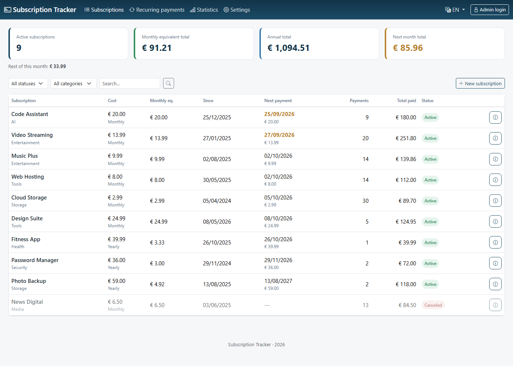
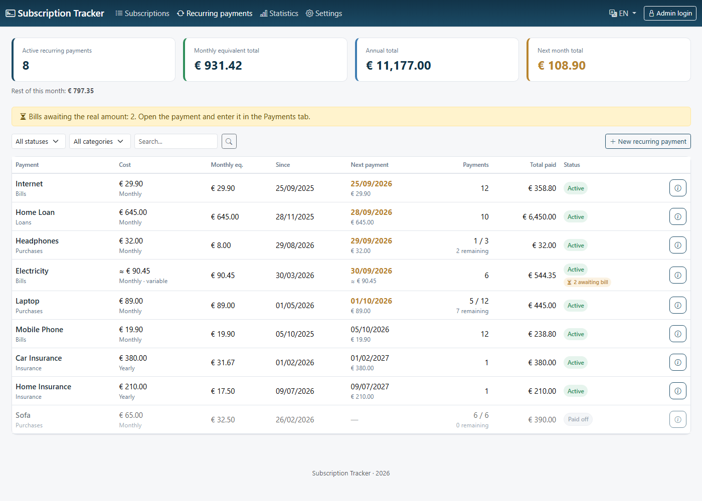
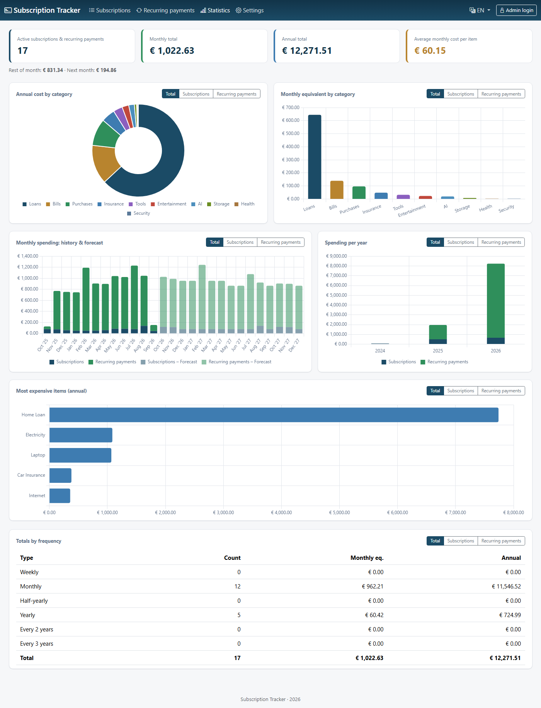
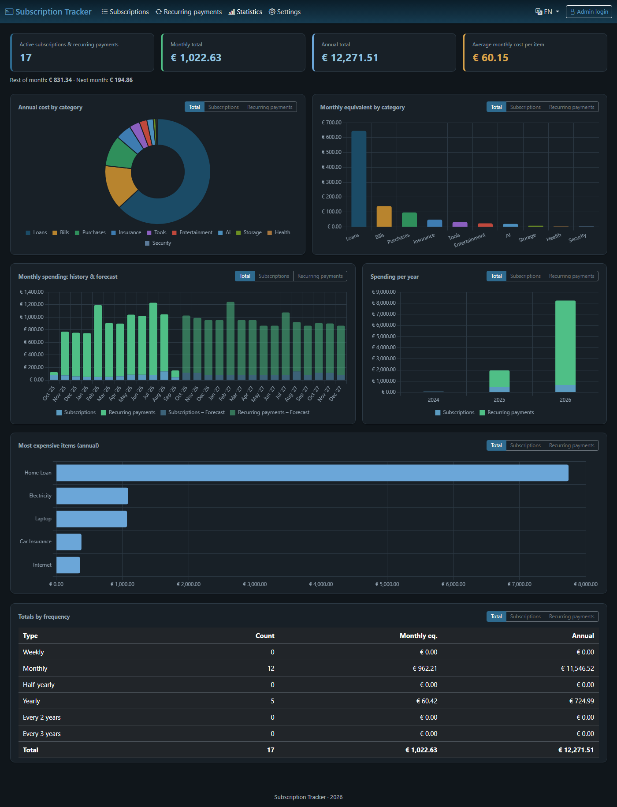

# PayCycle — Subscription Tracker

A PHP + SQLite app for tracking your personal subscriptions: when they
started, how many payments you have already made, when the next one is due and
how much you will pay next month. It also has a statistics dashboard with
Chart.js charts.

It is based on an Excel sheet ("Subscription Tracking.xlsx") that was kept by hand.

The interface is available in **Greek, English and German**, with a light/dark theme.

## Screenshots

_All screenshots use made-up demo data._

**Subscriptions**



**Recurring payments** — loans, installments, bills, insurance (with installment counters and bills awaiting their real amount)



**Statistics** — every chart has tabs for Total / Subscriptions / Recurring payments



**Dark theme**



---

## 1. Requirements

- PHP 8.1+ with the **pdo_sqlite** extension (almost always enabled by default)
- Apache2 (or any server that runs PHP). No mod_rewrite is needed and there are
  no "pretty" URLs.
- Nothing else. No Composer, npm or build step. Bootstrap 5, Bootstrap Icons
  and Chart.js are loaded from a CDN in the page (so the user's browser needs
  internet access to render the styling — your server does not).

## 2. Installation

1. Copy the whole folder to your server, e.g.:
   ```
   /var/www/html/subscriptions/
   ```
2. Give the web server user (usually `www-data`) write access to the `data/`
   folder so it can create the SQLite file the first time:
   ```
   chown -R www-data:www-data /var/www/html/subscriptions/data
   chmod 775 /var/www/html/subscriptions/data
   ```
3. Open the address in your browser, e.g. `https://.../subscriptions/`.
   The database (`data/subscriptions.sqlite`) is created automatically with an
   empty schema as soon as the first page loads — there is nothing to run by hand.

There are no sample subscriptions — you start from an empty list.

## 3. Users and the admin

The app supports **several users and one admin**. Users are stored in the
`users` table with a bcrypt password hash (never plain text).

- **First run:** the first time you open the **Login** page, while no user
  exists, the app asks you to create the **admin** (username + password of at
  least 8 characters).

  > Do this right after installing: whoever opens the Login page first on a new
  > database creates the admin.
- **Admin:** the only one who can add and remove users (menu **Users**), reset
  a user's password and change the global **Settings**. The last admin and your
  own account cannot be deleted.
- **Users:** can add and manage subscriptions, and change their own password
  (Settings). Every subscription records **who added it** (shown under the
  category in the list and in the details window). If a user is later deleted,
  the subscriptions they added stay, with their name kept as the creator.
- **History:** every action on a subscription (added, edited with the old and new
  values, price added/deleted, bill amount confirmed, frozen, unfrozen, canceled,
  reactivated, deleted) is logged with the user and the time, and is shown in the
  **History** tab of the details window. The log is kept in the
  `subscription_activity` table, also after a subscription or user is deleted.
- **Viewing** (subscription list, statistics dashboard) is open to anyone who
  has the link — no login is required. Login is needed for **management**.

**Upgrading from a single-password version:** the migration (run automatically,
with a backup of the database in `data/backups/`) turns the existing admin
password — from the database or from an old `config.local.php` with
`APP_PASSWORD_HASH` — into the user **`admin`** with the same password, and
attributes all existing subscriptions to it. If no password had ever been set,
no user is created and the first-run screen above appears; the existing
subscriptions are then attributed to the admin you create. No data is lost.
If you lose the admin password, delete the row of that admin from the `users`
table (e.g. `sqlite3 data/subscriptions.sqlite "DELETE FROM users WHERE role='admin'"`)
and the first-run screen appears again.

## 4. How the "payment ledger" works

This is the most important part of the logic, so it is worth understanding:

Every time a subscription is "charged" (monthly/yearly/etc.), the app
**records a real row** in a payments table — it does not just calculate things
"theoretically" each time you open the page.

- **When you add a subscription with a start date in the past** (e.g. you add
  today a subscription that actually started 8 months ago), the app **fills in
  the whole history automatically** — it records all the payments you would have
  made up to today — and correctly works out when the next one is due. You will
  see a message like "8 previous payments up to today were recorded automatically".
- **For subscriptions you already track**, every time you open the app it checks
  whether the next payment date, counted from the **last recorded payment** (not
  from the original start date), has passed and, if so, records it too. This way
  the history is built up gradually and correctly, without ever recounting from
  the beginning.
- If you add a price with an effective date in the **past** (e.g. "for the
  first 3 months it was cheaper"), the app retroactively corrects the amounts of
  the already recorded payments from that date onward.
- Periods that fall inside a **freeze** are not recorded as payments.
- In each subscription's modal (the pencil/info button) there is a **Payments**
  tab showing exactly which payments have been recorded.
- If you change a subscription's **frequency or start date**, its recorded
  payments are recalculated with the new values.

### Freeze vs. Cancel + Reactivate

- **Freeze/Unfreeze**: for a temporary pause where you know you will continue
  (e.g. you stopped a gym app for 2 months). The frozen months are correctly
  excluded from the calculation and the next payment shifts accordingly.
- **Cancel/Reactivate**: if you cancel and later reactivate the same
  subscription, the app automatically records the period in between as a
  "freeze", so no fictitious payments are created for a period when the
  subscription was not actually running.

## 5. Usage guide

- **New subscription**: button at the top right of the main page. Enter the
  real start date (even if it is old) — the history fills itself in.
- **Edit / Details**: the pencil button on each row opens a modal with 4 tabs:
  Details (name/category/frequency/date/notes), Payments (the actual history),
  Price history (add a new price here when the cost changes), Freezes.
- **Freeze / Unfreeze / Cancel / Reactivate / Delete**: from the (⋮) menu on
  each row.
- **Statistics**: cost by category, 12-month history and forecast, spending per
  year, most expensive items and totals by frequency. The summary cards and each
  chart show subscriptions and recurring payments **together** by default; every
  chart card has tabs to view **Subscriptions** or **Recurring payments** only.
- **Filters** on the main page: status, category, search by name.
- **Recurring payments** (menu item next to Subscriptions): the same list for
  everything else that repeats — loans, installments for purchases, phones,
  insurance, etc. They work exactly like subscriptions (same frequencies, price
  history, freezes, payment ledger) and have their own categories.
  A recurring payment can have an optional **number of installments** (e.g. a
  12-month loan). The list then shows `paid / total` with the remaining count,
  the forecast stops after the last installment, and once the last installment
  date has passed the status automatically becomes **Paid off** (Εξοφλήθη).
  Raising the number of installments later reactivates it.
  In the totals and charts, a payment with a fixed number of installments counts
  its plan total spread over the year: a purchase of 3 installments of €46.33
  counts €138.99 per year (€11.58 per month), not €46.33 every month.
  For bills whose amount is unknown until issued (electricity, mobile...), tick
  **Variable amount (bill)**. Each period is then recorded as an *estimate* (the
  average of your last 3 confirmed bills, or the estimate you typed at first) and
  flagged "awaiting bill". Enter the real amount in the **Payments** tab of the
  payment; confirmed amounts are used in all totals and charts, and future
  estimates and the forecast follow the new average.

## 6. Languages and Settings

- Available languages: **Greek, English, German**. A visitor can switch
  language from the menu at the top right (this only affects them, via a cookie).
- The **Settings** page (admin only to save) sets, for everyone:
  the default language, the theme (light / dark / automatic) and the default
  filter of the subscription list (status and category). The default filter
  only applies when the list is opened without a filter chosen.
- To add a language: copy `lang/en.php` to `lang/<code>.php`, translate it and
  add it to the `SUPPORTED_LANGUAGES` constant in `includes/i18n.php`.

## 7. Database and migrations

- The database `data/subscriptions.sqlite` is created automatically if it does
  not exist and is **not committed to git** (`.gitignore`).
- Schema changes are done with migrations (`includes/migrations.php`) that run
  automatically and never delete data. Before a migration is applied to an
  existing database, a copy is saved in `data/backups/`.

## 8. File structure

```
config.php                  settings (timezone, database path)
includes/db.php             SQLite connection (creates the database if missing)
includes/migrations.php     schema migrations (with a backup before upgrading)
includes/i18n.php           translations t() + settings (language/theme/filters)
includes/auth.php           users, login, roles (admin/user) + CSRF
includes/functions.php      calculation core + the "payment ledger"
includes/stats_helpers.php  aggregates for the dashboard
lang/el.php, en.php, de.php translations
index.php                   main subscription list
recurring.php               recurring payments list (same view, kind = recurring)
stats.php                   dashboard with charts
settings.php                settings page (+ change own password)
users.php                   user management (admin only)
login.php / logout.php
actions/*.php               management actions (POST only, CSRF + login required)
assets/style.css, assets/app.js
data/                       subscriptions.sqlite is created here automatically
```

## 9. Security

- Passwords are stored only as bcrypt hashes in the database, never in plain text.
- User management and global settings are restricted to the admin on the server side; a deleted user is logged out immediately.
- All management forms are protected with a CSRF token.
- All SQL queries use prepared statements (PDO).
- `data/` contains your SQLite file with all your data. It ships with a
  `.htaccess` that denies direct web access (Apache 2.4+). If your server is
  not Apache, make sure the folder is not reachable from the web, or place it
  outside the document root.
